# AWS API Gateway 5 Features
## 1. Authentication and Security Enforcement
### 1. IAM Authorization
- Uses AWS Signature Version 4 (SigV4) to authenticate requests
    + AWS SigV4 Official Document: https://docs.aws.amazon.com/IAM/latest/UserGuide/reference_sigv.html
    - AWS secrets are needed since SigV4 leverage them to create signature(hash)
    - AWS services, internal developers and engineers who can own its access key based on their role leverage this authorization method
    - boto3 SDK is a good wrapper for SigV4; Developer doesn't need to care about signing process
- Ideal for service-to-service communication within AWS (e.g., EC2 → API Gateway)
- Permissions are controlled via IAM policies — no extra infrastructure needed
#### Examples
| Who | Example |
|-----|---------|
|AWS services talking to each other | Lambda A calling Lambda B's API |
| Your backend servers on EC2/ECS | Internal microservice calling another service |
| Developers testing via CLI/SDK | aws CLI, Postman with AWS auth plugin |
| Automated CI/CD pipelines | GitHub Actions deploying via AWS SDK |

### 1.2 Lambda Authorizer (Custom Authorizer)
- A Lambda function you write that validates tokens (JWT, OAuth, API key, etc.)
- Returns an IAM policy (Allow/Deny) based on the validation result
- Perfect for integrating with third-party identity providers
- Supports result caching (TTL up to 3600s) to reduce Lambda invocations
```
Request ──► API Gateway ──► Lambda Authorizer ──► Validate JWT via JWKS
                                    │
                          Allow ◄───┴───► Deny
                            │
                      Forward to backend
```
#### Examples
| Example | Use When |
|---------|----------|
| JWT Validation | Users log in via Auth0, Cognito, Okta and your app sends Bearer tokens |
| Scope-Based Auth | Different roles need access to different endpoints |
| DynamoDB API Key | B2B partners with custom key management, expiry, and per-key permissions |
| IP + JWT Combined | High-security APIs (finance, healthcare) needing multi-factor access control |
#### Questions
> Could we leverage other AWS compute services for authorization?

|Compute Service | Auth Pattern | Best for |
|----------------|--------------|----------|
| EC2            | Reverse proxy / middleware | Legacy systems, persistent connections |
| ECS / Fargate | Sidecar container | Microservices needing consistent auth |
| ALB | Built-in OIDC | Browser-based web apps with login flow |
| App Mesh / Istio | mTLS service mesh | Kubernetes, large microservice clusters |
### 1.3 Amazon Cognito Authorizer
- Native integration with AWS Cognito User Pools
- Validates Cognito-issued JWTs automatically — no custom Lambda needed
- Checks token expiry, signature, audience (`aud`) and issuer (`iss`) automatically
#### Background Knowledge
##### Cognito
- User Pool — Authentication (Who are you?)
    + Manages user identities — sign up, sign in, and issues JWT tokens.
- Identity Pool — Authorization (What can you access?)
    + Exchanges Cognito tokens for temporary AWS credentials — lets users directly access AWS services like S3, DynamoDB.
- What Cognito actually does?
    + User registration
    + Password hashing
    + Email verification
    + Password reset
    + MFA(SMS, TOTP)
    + JWT token issues
    + Token refreshes
#### Exmaple
```
┌─────────────────────────────────────────────────────────────────┐
│                        Your Application                         │
│                                                                 │
│  Mobile / Web App                                               │
│       │                                                         │
│       │ 1. Sign in (email+password or Google/Apple)             │
│       ▼                                                         │
│  Amazon Cognito User Pool                                       │
│       │ 2. Returns Access Token (JWT, 1hr) +                    │
│       │         Refresh Token (30 days)                         │
│       │                                                         │
│       │ 3. API request + Authorization: Bearer <token>          │
│       ▼                                                         │
│  API Gateway                                                    │
│       │ 4. Validates JWT against Cognito JWKS automatically     │
│       │    Checks: signature, expiry, issuer, audience, scopes  │
│       │                                                         │
│       │ 5. Injects claims into request context                  │
│       ▼                                                         │
│  Backend Lambda                                                 │
│       │ Reads userId, groups, custom:plan from context          │
│       │ No re-validation needed                                 │
│       ▼                                                         │
│  DynamoDB / RDS / S3                                            │
└─────────────────────────────────────────────────────────────────┘
```
### 1.4 API Keys & Usage Plans
- Generate API keys and attach them to Usage Plans
- Usage Plans control:
  - Throttling: requests per second (RPS)
  - Quota: max requests per day/week/month
- Useful for monetizing APIs or rate-limiting external developers
#### Example
| Concept | What it does |
|---------|--------------|
|API Keys | Identifies the caller |
|Rate limit | Max requests per second |
|Burst limit | Short spike allowance |
| Quota | Max requests per day/week/month |
| Usage Plan | Groups rate limit + quota together |

### 1.5 Resource Policies
- JSON-based policies attached directly to the API
- Can whitelist/blacklist specific IP ranges or VPCs
- Enable cross-account API access
#### Examples
| Situation | Resource Policy (IAM) to use |
|-----------|------------------------------|
| Allow Only Specific IP Addresses | aws:SourceIp whitelist |
| Allow Only Traffic From Inside your VPC | aws:sourceVpc restriction |
| Cross Account Access | aws:sourceVpce restriction |
| IAM Role Permission Policy | aws:PrincipalAccount + Principal ARN |
| Restrict specific HTTP Methods Per Path | Method-level Allow per Principal |

# 2. Load Balancing & Circuit Breaking
## Background
- API Gateway doens't do traditional load balancing by iteself.
- API Gateway achieves load balancing by integrating with ALB, NLB, or Lambda — which handle the actual traffic distribution.
## 2.1 Load Balancing
### 1) With Lambda
- Most people think of load balancing as "distributing traffic across multiple servers." Lambda flips this entirely — instead of routing to existing servers, AWS creates a new instance per request.
- **Key rule**: One Lambda instance handles exactly one request at a time. No sharing, no concurrency within a single instance.
```
Incoming Requests (over time)
─────────────────────────────

t=0ms   → req 1 arrives  → no warm instances → cold start → instance A created
t=10ms  → req 2 arrives  → instance A busy   → cold start → instance B created
t=10ms  → req 3 arrives  → no warm instances → cold start → instance C created
t=500ms → req 1 done     → instance A now idle (stays warm)
t=600ms → req 4 arrives  → instance A warm   → reused ✅ (no cold start)
t=700ms → req 5 arrives  → instance B warm   → reused ✅
t=700ms → req 6 arrives  → instance C warm   → reused ✅
t=700ms → req 7 arrives  → all busy          → cold start → instance D created
```
### 2) with ALB (EC2 / ECS Backend)
- Lambda is great for serverless, but many teams run workloads on EC2 or ECS — either because:
```
Legacy codebase        → already running on EC2, can't rewrite as Lambda
Long-running processes → exceed Lambda's 15min limit
Stateful connections   → WebSockets, persistent DB connection pools
Large memory needs     → Lambda max is 10GB, EC2 has no limit
Containerized apps     → team already uses Docker on ECS
```
- The problem: EC2/ECS services live inside a VPC — private, not accessible from the internet. API Gateway lives outside your VPC. You need a bridge between them. That bridge is VPC Link + ALB.
### 3) Canary Deployment
- API Gateway natively supports canary deployment(the gradual traffic shifting apprach)
- The same URL serves both versions — API Gateway randomly routes each request based on the percentage you set.
```
prod stage
┌─────────────────────────────────────────┐
│                                         │
│  Base deployment (v1)  ←── 90% traffic  │
│  Canary deployment (v2) ←── 10% traffic │
│                                         │
│  Same stage URL:                        │
│  https://abc123.execute-api.../prod/    │
│                                         │
└─────────────────────────────────────────┘
```
### 4) Multi Region Load Balancing
```
User types: api.yourapp.com
        │
        ▼
Route 53 receives DNS query
        │
        ├── Where is this user coming from?   Seoul
        ├── Which region is closest?          ap-northeast-2
        ├── Is that region healthy?           ✅ yes
        │
        ▼
Returns IP of ap-northeast-2 API Gateway
        │
        ▼
User's request goes directly to Seoul
```
- Use multi-region when:
    + Users are globally distributed
    + Latency is a core product requirement
    + Need 99.99%+ availability (single region = 99.9%)
    + Regulatory requirements (EU data must stay in EU)
    + Your traffic justifies the cost (running 3x infrastructure)

- Skip multi-region when:
    + All users are in one country
    + Cost is a primary concern
    + Simple internal API
    + Latency is not critical
## 2.2 Circuit Breaking
### Background 
- In distributed systems, services call each other constantly. When one service starts failing or slowing down, without a circuit breaker, every caller keeps hammering it — making things worse until everything collapses.
- This spread of failure is called a cascading failure — and circuit breaking is specifically designed to stop it.
### 1) Throttling
- API Gateway sits in front of everything. Its job in throttling is to make decisions before any request reaches your backend — acting as a protective wall.
- **The key point: API Gateway absorbs the excess traffic itself. Your backend is completely unaware that a traffic spike ever happened.**
```
Internet                                    Your Backend
   │                                             │
   │    All requests must pass through here      │
   ▼                                             │
API Gateway  ←─── THIS is the gatekeeper         │
   │                                             │
   ├── Allowed? ──────────────────────────────►  │
   │                                        Lambda / ECS / EC2
   └── Rejected? → 429 instantly
       (backend never sees this request)
```
#### What API Gateway does?
- Counts Every Incoming Request
    + API Gateway maintains real-time counters for every level simultaneously:
- Manages the Token Bucket Per Level
    + API Gateway maintains separate token buckets for each throttling scope:
- Returns 429 Immediately — No Backend Involvement
### 2) Timeout
- Without a Timeout, a slow backend causes a thread starvation problem
- API Gateway has hard 29-Seconds Limit
    + if your API takes > 29s, it should be async, not synchronous
- API Gateway's timeout is a hard deadline — if your backend doesn't respond in time, API Gateway cuts the connection immediately and returns 504, freeing resources and giving clients a fast failure rather than an indefinite wait.
### 3) Lambda Reserved Concurrency
- API Gateway's role with reserved concurrency is to catch Lambda's throttle errors, automatically retry them, and translate failures into clean, customizable HTTP responses — so the client gets a meaningful error rather than a raw internal AWS exception.
```
{
  "errorType": "TooManyRequestsException",
  "errorMessage": "Rate Exceeded"
}
```
# 3. Protocol Translation & Service Discovery
## 3.1 Protocol Translation

### REST to Lambda Event
- API Gateway does this translation automatically
### REST to AWS Services
- The most powerful translation — no Lambda needed at all. API Gateway calls AWS services directly using mapping templates.
    + SQS
    + DynamoDB
    + Step Functions
## 3.2 Service Discovery
### 1) VPC Link + NLB
- Service locations constantly change
    + Today IP: 10.0.8.15
    + Yesterday IP: 10.0.8.16
- NLB has a stable DNS name that always resolves to healthy target
### 2) Cloud Map
- API Gateway can ask 'Cloud Map'
### 3) Stage Variables
```
# Stage variables — each stage knows its own backend
dev_stage = apigw.Stage(self, 'DevStage',
    deployment = deployment,
    stage_name = 'dev',
    variables  = {
        'backendUrl': 'http://dev-nlb.internal.com',
        'tableName':  'orders-dev'
    }
)

prod_stage = apigw.Stage(self, 'ProdStage',
    deployment = deployment,
    stage_name = 'prod',
    variables  = {
        'backendUrl': 'http://prod-nlb.internal.com',
        'tableName':  'orders-prod'
    }
)
```
```
GET /dev/orders  → API Gateway reads stageVariables.backendUrl
                 → routes to dev-nlb.internal.com ✅

GET /prod/orders → API Gateway reads stageVariables.backendUrl
                 → routes to prod-nlb.internal.com ✅

Same API definition — different backends per stage ✅
```
# 4. Monitoring, Logging, Analytics & Billing
## Background Knowledge
AWS Official Doc: https://docs.aws.amazon.com/apigateway/latest/developerguide/api-gateway-metrics-and-dimensions.html
## Summay
API Gateway's observability stack gives you metrics to detect problems, logs to understand them, traces to locate them, and usage data to bill for them — forming a complete picture of everything happening in your API.
### Layer Table
|Layer | Tool | Ansers |
|------|------|--------|
|Metrics|CloudWatch|How many requests? How fast? How many errors?|
|Logs|CloudWatch Logs|Which request failed? What was the error?|
|Tracing|X-Ray|Where did time go? Which service is slow?|
|Billing|Usage Plans|Who used how much? What should we charge?|
# 5. Caching
- API Gateway has a built-in in-memory cache at the stage level. It stores backend responses and serves them directly — backend never gets called for cached requests:

## 1) Mechanism
### Cache Keys — What Makes a Unique Cache Entry
- The cache key determines when API Gateway considers two requests identical and can serve a cached response.
- By default the full URL path is the cache key
```
With query string in cache key:
  GET /products/123?color=red   → key = "/products/123?color=red"
  GET /products/123?color=blue  → key = "/products/123?color=blue"
  └── different cache entries
```
### Per-Method Cache Settings
Different endpoints need different TTLs — configure them individually:
```
deploy_options = apigw.StageOptions(
    stage_name            = 'prod',
    cache_cluster_enabled = True,
    cache_cluster_size    = '1.6',

    method_options = {

        # Product list — cache aggressively (changes rarely)
        'GET /products': apigw.MethodDeploymentOptions(
            caching_enabled               = True,
            cache_ttl                     = Duration.hours(1),
            cache_data_encrypted          = True
        ),

        # Single product — cache moderately
        'GET /products/{productId}': apigw.MethodDeploymentOptions(
            caching_enabled               = True,
            cache_ttl                     = Duration.minutes(10),
            cache_data_encrypted          = True
        ),

        # Orders — short cache (changes frequently)
        'GET /orders': apigw.MethodDeploymentOptions(
            caching_enabled               = True,
            cache_ttl                     = Duration.minutes(1),
            cache_data_encrypted          = True
        ),
```
## 2) Authorization
- For user-specific responses, include the authorization token:
### Each user gets their own cache entry
```
cfn_method.integration = {
    'cacheKeyParameters': [
        'method.request.header.Authorization'  # Per-user cache
    ]
}
User A token → GET /orders → cached response for User A
User B token → GET /orders → separate cached response for User B
```